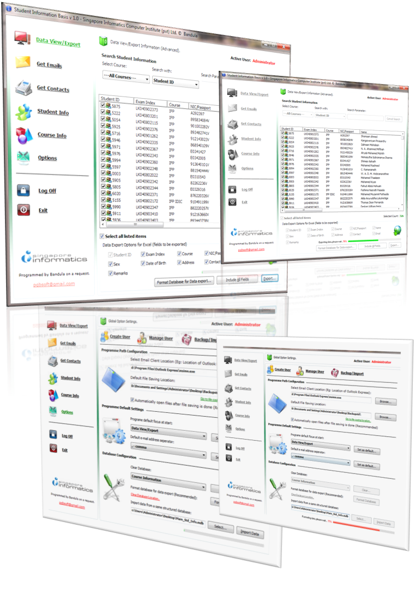

## A database programme with exceptional features\. \(You will learn a lot from this\. It’s a promise\.\)

### Description

With this simple, but powerful database programme you will mainly learn the followings.

• How to develop a powerful database programme by using ListView, ImageList Microsoft ActiveX Data Objects Library, Microsoft Excel Object Library for a higher portability.

• How to easily use Listview control with filtering and exporting techniques (Exporting data with different combination of fields) to get the output in various aspects.

• How to do file handlings/clipboard related operations.

• How to remove unnecessary characters from the data.

• How to use Microsoft Excel for the reporting purpose of the programme without using Crystal Reports, Data reports.

• How to use a simple database programme in a network environment.

• How to import data from a same structured database while checking the duplicate entries.

• How to include basic system maintenance features of a database programme like creating, deleting users, setting user permissions, changing user passwords, resetting passwords and etc.

• How to easily implement a simple encryption to encode the constants, user passwords and the database password for a higher security.

• How to use a backdoor (An alternate and secret way of entering a computer system) with a database programme to bypass its password protected access. (Education purpose only.)

• How to manipulate windows registry easily with few lines of code.

• How to do a search in a database programme efficiently and implement an advanced search.

• How to use functions and sub procedures to get the various operations done easily in the programme.

• How to utilize the pictures stored in resource within the programme.

• How to really use a Splash window with a programme.

• How to use a good looking and easily-created progress bar without any additional coding, for the operations of the programme with the database. (Operations include clearing data, importing data, exporting data, formatting data with the database.)

• How to create a well-arranged, good looking and flexible user interface with professional features in ease, in a limited screen area.

• If you are a beginner you will learn how to create an application with professional features in ease with basic programming skills you have without going for a complicated coding style.
 
### More Info
 

             |
---                |---
**Submitted On**   |2011-10-20 23:17:22
**By**             |[P\. G\. B\. Prasanna](https://github.com/Planet-Source-Code/PSCIndex/blob/master/ByAuthor/p-g-b-prasanna.md)
**Level**          |Intermediate
**User Rating**    |4.8 (111 globes from 23 users)
**Compatibility**  |VB 6\.0
**Category**       |[Databases/ Data Access/ DAO/ ADO](https://github.com/Planet-Source-Code/PSCIndex/blob/master/ByCategory/databases-data-access-dao-ado__1-6.md)
**World**          |[Visual Basic](https://github.com/Planet-Source-Code/PSCIndex/blob/master/ByWorld/visual-basic.md)
**Archive File**   |[A\_database2218241152012\.zip](https://github.com/Planet-Source-Code/p-g-b-prasanna-a-database-programme-with-exceptional-features-you-will-learn-a-lot-from-th__1-73908/archive/master.zip)

